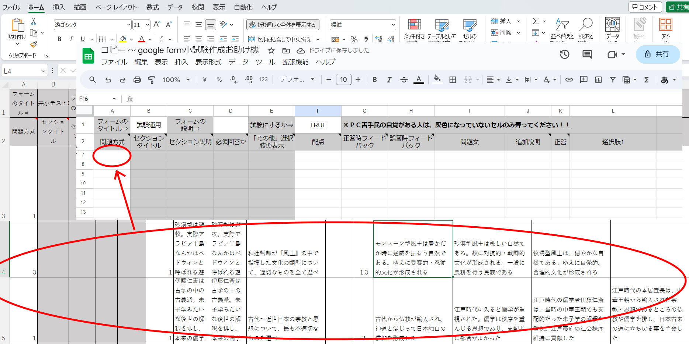

# 小テスト労力削減プロジェクト  
  
## 概要  
Q：OKグーグル、三行でまとめて  
A：[小テストの実施がクソ楽になるシステム（？）](https://docs.google.com/spreadsheets/d/1s9_LWIf5J94E5uxImTizUMgsUC_8fi7VaLUch8npO7w/copy)を作ったからみんな使ってみて♡  

### 更新履歴  
  
R05/10/1：ver1.11：randomize機能で、「設定」シート7行目以降の情報を消去してから貼り付けをするように変更  
R05/9/28：ver1.10：createForm機能の全面改修とバグ取り（フィードバックが正しく適用されないバグの修正）  
R05/8/24：ver1.00：基本機能完成。公開  

### 前説  
  
・令和五年現在、学習指導要領の改訂が続いています  
・その結果として（特に中高の）現場の先生方には、小テスト実施の圧力が強まっています  
・毎週、何なら毎授業で小テストをやれ、と言われているような状態です  
・言うまでもなく、これはとんでもない負担です  
⇒仮に「週３時間の授業を６クラス持っている」「１クラス３０人」として、毎週小テスト実施するだけで毎週１８０人ぶんの答案を採点する事になります。教員の過重労働が問題になっているこの時代に、無茶言うなバカタレという話で…  
  
### そこで！　皆さん、機械の力を使って労力を削減しませんか！！  
  
・今どきの中高生なんか皆タブレットなりノートPC配られてますし、そうでなくても携帯持ってます  
・彼らが持っている端末で試験を受けさせ、労力を削減しましょう！  
・googleが無料提供してくれているgoogleスプレッドシート、googleフォーム、google apps script(GAS)で、仕事が便利になります！  
・以下、本プロジェクトでできること  
  
  
１：選択肢式の**小テストを、excel、googleスプレッドシートで作成・管理できる**
  
  
２：**単一選択、複数選択の両方に対応**  
  
  
３：20問作って10問を**ランダム出題**みたいな事ができる  
  
４：小テストが**自動採点**される（googleフォームの標準機能）  
５：成績を**学年組番号順に並べ替え**できる（googleスプレッドシートの標準機能）  
６：アンケート作成にも対応（小テストだけでなくアンケートも、excelやgoogleスプレッドシートで作成できる）  
  
### 注意事項等
・なお、本プロジェクトでは選択肢式の小テストのみ対応しています  
・記述問題は正解が沢山できてしまうので、機械による自動採点とは極めて相性が悪いです  
  
例１：薩長同盟の立役者とされており、また海援隊を作ったとされるのは？  
⇒坂本龍馬だけど坂本竜馬でもいいし、何なら、本来は坂本直陰もしくは坂本直柔って表記した方がいい人だし…  
  
例２：現在、デンマーク王国がある半島の名前は？  
⇒ドイツ語ならユートラント半島だし、英語ならジェットランド半島だし、日本では両者が混ざったユトランド半島って呼ばれてるし…なんならﾕﾄﾗﾝﾄﾞ半島って表記してもいい訳で……  
  
・そういうのもあって、小テストでは選択肢式の採用を強く推奨します  
⇒そもそも小テストは、授業時間を圧迫しないよう数分で終わらせるのが理想ですし… 「漢字を書かせたい」がある科目、例えば日本史でも、期末試験でやればいいだけだし……  
  
・また、今回作成したものは、[こちらの記事](https://gasgas.itokeisuke.jp/gas/177/)を読みながら勉強し、その後、[ChatGPT](https://chat.openai.com/auth/login)先生と協力しながら作りました。ここにお礼を申し上げます  
  
## 本プロジェクトの使用方法

### 事前準備
  
  
  
[１：こちらの文章をクリックし、その後「ドキュメントのコピー」をクリックしてください](https://docs.google.com/spreadsheets/d/1s9_LWIf5J94E5uxImTizUMgsUC_8fi7VaLUch8npO7w/copy)  
※そしてこのページに戻ってきてください  
※画像のような画面にならず、「google」「ログイン」と出てきた場合は↓の「※googleとかログインとか出た場合はこちら」をクリック  
  

・本プロジェクトではgoogleの機能を使用するので、googleにログインする必要があります  
・gmailを使ったことがあるのであれば、gmailアドレスを持っている筈ですのでそれを使います  
・gmailアドレスがない場合は、新規作成します  
※大抵の教員は、gmailアドレスを学校から配られていると思いますので、それを使う事になるでしょう  
  
●gmailアドレスを持っている場合  
１：「メールアドレスまたは電話番号」にあなたのgmailアドレスを入力し、「次へ」をクリック  
２：「パスワードを入力」にあなたのパスワードを入力し、「次へ」をクリック  
３：「ドキュメントのコピー」が出てきます  
※２の後、下の方の「後で行う」をクリックしないと３に辿り着けない場合もあります  
  
●gmailアドレスを持っていない場合  
[この辺りを参考に、gmailアドレスを作成してください](https://appllio.com/gmail-create-new-account)  

  
  
  
２：「コピー ～ google form小試験作成お助け機」が、googleスプレッドシートで開かれます  
※こいつを使って、小テストを作成していきます  
※なお、「コピー ～ google form小試験作成お助け機」はあなたのgoogleドライブの「マイドライブ」に入っています。[こちら](https://drive.google.com/drive/my-drive)をクリックして「マイドライブ」を開き、確認してみましょう  
  
### 試験作成
  
  
１：スプレッドシートに問題を入力していきます  
※慣れている人以外は、白いセルのみ入力してください。灰色のセルは弄らないでください  
※うっかり灰色のセルを弄っちゃった場合は↑の画像の赤で囲んだところをクリックすると戻ります  
  
  
※どのセルに何をどう入力すればいいかは、スプレッドシートに記載してあります  
①右上に黒三角があるセルに  
②↑の画像のようにマウスポインタを持っていくと  
③↑の画像のように、何をどのように入力すればいいか出てきます  
  
  
２：試験の打ち込みが終わったら、「拡張機能」をクリック、更に「Apps Script」をクリック  
※「Apps Script」をクリックすると新しいタブが開かれて、↓のような画面になります  
  
  
３：「デバッグ」の右が「createForm▼」になっているのを確認して、「実行」をクリック  
※「createForm▼」になっていない場合は、該当箇所をクリックした上でcreateFormをクリックしてください  
※この後の手順４５は初回のみ必要なものですので、折りたたみました。以下の「手順４５はこちら」をクリックして確認してください。二回目以降の人は手順６へ飛びます  
  
  
  
  
４（初回のみ）：「承認が必要です」と出るので、「権限を確認」  
  
  
５（初回のみ）：↑のような画面になるので、「許可」をクリック  
  
  

  
６：↑の画像のように、実行ログが出てきます。「実行完了」と出てきたら、試験作成完了です  
  
  
７：試験は、あなたの「マイドライブ」に作成されます。ダブルクリックして試験を開き、確認しましょう  
※マイドライブは[こちら](https://drive.google.com/drive/my-drive)。もうブックマークしておきましょう  
※試験の名前は、スプレッドシートのB1セルに入れたものになっています  
※試験を開くと、学年組番号氏名入力ゾーンの更に下に、あなたが入力して作った問題があります  

  
８（推奨）：試験が正常に作成されているのを確認したら、「設定」タブをクリック  ⇒「成績の発表」を「送信直後」に、「不正解だった質問」「正解」「点数」をオンにするとよいでしょう  
※必須の操作ではありませんが、試験返却の手間が省けるので推奨します  
※ここの設定は、どうも自動ではできないみたいです。なので手動でお願いします  

  
９：右上の「送信」、続いて知恵の輪マーク、そして「コピー」を順番にクリック。後は、コピーしたURLを生徒に教えれば、生徒は試験を受けられます  
※コピーしたURLを生徒に教える方法は何でも構いません。メールでも、LINE（やLINEに類似したチャットツール）でも、QRコードでも、ロイロノートのwebカードも…  
  
### Excelで問題を作成・管理する
・ところで。恐らくですが、大抵の人は普段、googleスプレッドシートではなくExcelで仕事をしています  
・なので大抵は、「問題の打ち込みはExcelでやる」「googleフォームの試験を作る時だけ、スプレッドシートを使用」の方がいいでしょう  
・という訳で、Excelをご用意してあります  

[１：こちらの文章をクリックし、「ドキュメントのコピー」をクリック](https://docs.google.com/spreadsheets/d/1e0a8Bx3aolfAFXg3y4bVKLTXc1bhJ8Lt/copy)  
※クリックした後、スプレッドシートが開きますが閉じてください  
  
  
２：[マイドライブ](https://drive.google.com/drive/my-drive)にテンプレファイルが作成されるので、右クリック⇒ダウンロード  
  
  
３：あなたのＰＣにexcelファイルがダウンロードされる（windows10や11なら「ダウンロード」フォルダに保存されます）ので、適宜問題を作成  
  
  
４：試験を作成する時は、excelで作成した問題を、「google form小テスト作成お助け機」のA7セルにコピー＆ペーストしてください  
  
### 試験情報漏洩を心配する人向け機能（ランダム出題機能）の使用  
  
・ところで、これから「googleフォームで小テストをやろう！！」という話を自分の学校でしたい皆さん  
・こんなことを言う同僚が出てくる可能性を心配していませんか？  
・「小テストの情報の漏洩が気になる」「紙の試験なら生徒の記憶だけが頼りだけど、生徒のタブレットとか携帯で試験となると…」  
  
  
[※元ネタはコチラ](https://twitter.com/nmnoy/status/904540273358684164)  
  
・…と言う訳にもいかないので、何か説得材料が必要な訳ですが…  
・そんな時オススメしたいのが、「20問作ってクラスごとに10問をランダム出題」メソッドです  
・とにかく「問題を多めに作って」「クラスや実施日ごとにランダム出題する」というやり方を提案すると、概ね通ります  
・そのための機能もご用意してあります。以下で使い方を解説します  
  
  
１：「google form小テスト作成お助け機」は、下の方をよく見ると「ランダム出題用」があります。そちらをクリック  
  
  
２：B1セルに出題数を入力します。また、3行目以降に問題データを入力します。excelで問題を作って、A3にコピペするのが丸いでしょう  
  
  
入力例：今回は15問作って10問ランダム出題する事にしました。なのでB1セルに「10」が、3行目以降には15行分の問題データが入力されています  
  
  
３：「拡張機能」をクリック、更に「Apps Script」をクリック  
※「Apps Script」をクリックすると新しいタブが開かれて、↓のような画面になります  
  
  
４：「デバッグ」の右が「randomize」になっている事を確認して（そうなっていない場合はクリックして、「randomize」を選んで）、「実行」をクリック  
  
  
５：実行完了後、googleスプレッドシートの「google form小テスト作成お助け機」の設定タブに、指定した数の問題がランダム出題されています。確認してみましょう  
  
  
６：後はApps Scriptに戻って、createFormを実行すればOKです！  
  
## 成績確認＆処理の手引き

・googleフォームで実施した小テストは、自動で採点されています  
・ところで、今時の教員は大抵、excelファイルで生徒の成績を管理していますね？  

  

・↑こういうexcelファイル作って、成績管理してるのが普通ですよね？  
・という訳で、googleフォームで実施した試験の成績を、↑こういうexcelファイルへ簡単に移植する方法を紹介します  
※教務手帳に点数をメモって手計算してる人も、やり方は基本同じです  
  
・PCでgoogleドライブを開いて、自分の試験が置いてあるフォルダを見るところから手順紹介を始めます  
※【定期】マイドライブであれば[こちら](https://drive.google.com/drive/my-drive)  
  
  
１：点数を確認したい試験を開きます（ダブルクリックで開きます）  
  
  
２：試験が開かれたら、「回答」タブをクリックし、「スプレッドシートにリンク」をクリック（緑地に白のスカンジナビア十字のやつ）  
※「回答」タブを押すと、画像で示したところに平均点や誤答の多い問題の分析等が出ます。こちらも便利ですが、今回は個別の成績をexcelにコピペするのが最終目標なので、使いません。決断的にスプレッドシートにリンクしてください  
  
  
３：こんなポップアップが出るので、「新しいスプレッドシートを作成」を選んで「作成」をクリック  
  
  
４：こんな画面になります。左から  
タイムスタンプ：回答を送信した日時。URL控えておいて後日送った不届き者はここから分かります  
スコア：点数です  
学年クラス番号姓名：誰の回答かの判断に使います  
Gより右：その問題の答えとしてどれを選んだかが載ってます  
  
  
５：出席番号順に並べ替えましょう。出席番号はEの列なので、Eをクリックしてから青くなったフィールド上で右クリックして、「昇順でシートを並べ替え」をクリックします  
  
  
※尚、複数のクラスで同じ試験を実施した場合は、並べ替え操作をD列とE列で交互にやってください。その内こんな風に組番号順になります  
※教務手帳にメモる派の人は、基本ここまでです。後は頑張ってメモって、手計算してください。でもこの際だからexcel導入してみては…？  

  
６：ここで、新しいexcelファイル（もしくはexcelシート）を作ってAをクリック、色が変わったフィールドで右クリック。「セルの書式設定」をクリック  
※成績をエクセルファイルとかで管理する時、ほしい点数の表記は「7 / 10」じゃなくて「7」ですよね。ここからはそのための作業です  
  
  
７：「文字列」をクリックして「OK」  
  
  
８：先程の成績一覧スプレッドシートに戻り、点数をコピーし、さっきのエクセルのA列に貼り付けます  
※A1セルを右クリック→「貼り付けのオプション」で「貼り付け先の書式に合わせる」を選ぶとよいでしょう  

  
９：またAをクリックしてから、「ホーム」タブが選択されている状態の右上にある「検索と置換」をクリックし、「置換」をクリック  
※もしくはAをクリックしてから、CTRLキー+Fキー→「置換」をクリック  

  
１０：「検索する文字列」に「 / 10」（半角スペース、半角スラッシュ、半角スペース、半角数字で１０）を入力。「置換後の文字列」が空白になっているのを確認して「全て置換」をクリック
※10点満点の場合。20点満点なら数字のところは20、30点満点なら30を入力します
  
  
１１：うーんマンダム。後は自分のexcelファイルに貼り付ければ…
  
  
１２：これにて処理完了です  

## ＰＣの操作がそれなりにできる人向け情報
### ＰＣの操作がそれなりにできる人向け情報　その１
・今回私が作ったスプレッドシート、実は3～6行目が隠れています  
・実は、ここに「あなたの学年は？」「あなたの姓名は？」系の質問を突っ込んでいます  
  
  
よく見ると、2行目の7行目の間に謎の▲や▼が表示されています。これをクリックすると…  
  
  
この通り、隠れていた3行が出てきました。ここで学年学級姓名を聞いていたんですね  
  
・もし必要であれば、この3行を書き換えるのもいいでしょう  
・例えば学級と出席番号の代わりに学籍番号を聞くとか、そういう事もできるでしょう  
  
・但しこの手の質問を、7行目以降に拡張するのはやめた方がいいでしょう  
※先に紹介したfunction randomizeが「「設定」シートの7行目以降を削除する」「「ランダム出題用」シートから持ってきたデータを「設定」シートの7行目以降に貼り付ける」という挙動をするため。もしそこを書き換えたい場合は、拡張機能⇒apps scriptでコードを開いて、randomizeのコードを弄ってください  
  
  
apps scriptのfunction randomizeの、この辺を弄れば目的は達されます  

### ＰＣの操作がそれなりにできる人向け情報　その２
・今回私が（chatgptにお願いして）作ったスクリプトは、割と簡単に弄れるようにしています  
・人並み以上にＰＣ操作ができる人であれば、自分にとって便利なように一部書き換えて使えると思います  
  
  
「google form小試験作成お助け機」を開き、App Scriptを開いてみましょう。行頭に「//」がついているのがコメントです。その行にどのような命令が書いてあるか、解説しています  
  
  
この辺りを弄ると、作成されるgoogleフォームの設定を変えられます。「うちではメールを収集している」とか「うちでは回答を１回に制限する形で小テストやってる」とかあれば、ここを弄れば、毎回設定タブから設定しなおす手間が省けます  